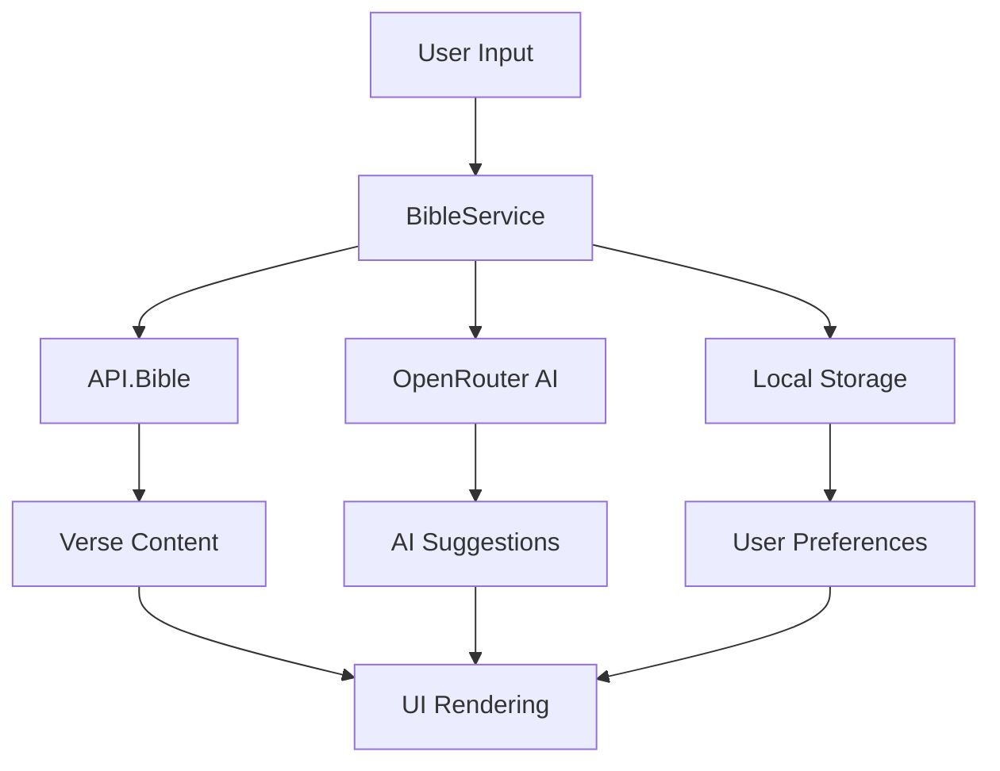

# 📖 Bible.ai

<div align="center">


**A Modern, AI-Powered Bible Reading Experience**

[](https://nextjs.org/)
[](https://www.typescriptlang.org/)
[](https://tailwindcss.com/)
[](LICENSE)

[🚀 Live Demo](https://bible-ai.vercel.app) • [📚 Documentation](docs/) • [🐛 Report Bug](https://github.com/Rais-th/Bible.ai/issues)

</div>

---

## ✨ Features

### 🌍 **Multi-Language Support**
- 📖 **5 Bible Translations**: English (WEB), French (LSG), Swahili (SWA), Lingala (LIN), Shi (SHI)
- 🔄 Dynamic UI language switching with localized book names
- 💾 Persistent reading position across translations

### 📱 **Mobile-First Experience**
- 🎨 **Glass Morphism Design**: Modern UI with backdrop blur effects
- 📺 **TikTok-Style Shorts**: Social media inspired Bible content discovery
- 🌓 **Adaptive Theming**: Light/Dark mode with nebula backgrounds
- 📐 **Responsive Design**: Optimized for all screen sizes

### 🤖 **AI-Powered Features**
- 🎯 **Smart Verse Suggestions**: Natural language queries for relevant Bible verses
- 🧠 **AI Explanations**: Theological insights and practical applications
- ⚡ **Instant Lookup**: Fast in-memory verse retrieval system

### 🎭 **User Experience**
- 🔖 **Reading Memory**: Automatic position saving with localStorage
- 🔤 **Font Controls**: Customizable reading experience (12px-32px)
- 🎪 **Smooth Animations**: Framer Motion powered transitions
- 📊 **Progress Tracking**: Chapter navigation with visual indicators

---

## 🛠️ Tech Stack

<div align="center">

| Frontend | Backend | AI & APIs | Styling |
|----------|---------|-----------|---------|
|  |  |  |  |
|  |  |  |  |
|  |  |  |  |

</div>

---

## 🚀 Quick Start

### 📋 Prerequisites

-  
-  or 

### 🔧 Installation

1. **Clone the repository**
   ```bash
   git clone https://github.com/Rais-th/Bible.ai.git
   cd Bible.ai/bible
   ```

2. **Install dependencies**
   ```bash
   npm install
   ```

3. **Set up environment variables**
   ```bash
   cp .env.example .env.local
   ```
   
   Add your API keys:
   ```env
   NEXT_PUBLIC_API_BIBLE_KEY=your_api_bible_key
   NEXT_PUBLIC_OPENROUTER_API_KEY=your_openrouter_key
   GOOGLE_API_KEY=your_google_api_key
   ```

4. **Run the development server**
   ```bash
   npm run dev
   ```

5. **Open your browser**
   Navigate to `http://localhost:9002` 🎉

---

## 📱 App Architecture

### 🏗️ **Component Structure**

```
📦 Bible.ai
├── 🎯 Core Reading Experience
│   ├── 📱 BibleReaderMobile (Full-screen glass morphism)
│   ├── 💻 BibleReaderDesktop (Traditional layout)
│   └── 🔄 BibleReader (Responsive wrapper)
├── 📺 Shorts Feature
│   ├── 📱 ShortsMobile (TikTok-style interface)
│   ├── 💻 ShortsDesktop (Grid layout)
│   └── 🎬 Shorts (Main component)
└── 🤖 AI Integration
    ├── 🎯 Verse Suggestions
    ├── 💡 Explanations
    └── 🔍 Smart Search
```

### 🔄 **Data Flow**



---

## 🎨 Design System

### 🌈 **Glass Morphism Elements**
- **Content Cards**: `bg-black/30 dark:bg-black/40 backdrop-blur-xl`
- **Navigation Pills**: `bg-white/80 dark:bg-neutral-800/60 backdrop-blur-lg`
- **Floating Buttons**: `bg-white/10 hover:bg-white/20 backdrop-blur-sm`

### 📐 **Responsive Breakpoints**
- **xs**: Extra small screens (custom breakpoint)
- **sm**: Small screens (640px+)
- **md**: Medium screens (768px+) - Desktop layout switch
- **lg+**: Large screens with enhanced spacing

---

## 🔌 API Integration

### 📖 **Bible Content (API.Bible)**
- **Primary Source**: `scripture.api.bible`
- **5 Translations**: Multi-language support
- **HTML Parsing**: Advanced verse extraction
- **Fallback System**: `bible-api.com` backup

### 🤖 **AI Features (OpenRouter)**
- **Model**: `mistralai/mistral-7b-instruct:free`
- **Structured Output**: JSON schema validation with Zod
- **Smart Prompting**: Context-aware verse suggestions
- **Explanation Engine**: Theological insights generator

---

## 📊 Performance Features

- ⚡ **In-Memory Lookup**: Fast verse retrieval with KJV_DATA
- 🎯 **Optimized Parsing**: Efficient HTML content processing
- 💾 **Smart Caching**: localStorage for user preferences
- 📱 **Mobile Optimized**: Hidden scrollbars and smooth animations
- 🔄 **Lazy Loading**: On-demand chapter loading

---

## 🤝 Contributing

We welcome contributions! Here's how you can help:

### 🐛 **Bug Reports**
- Use the [issue tracker](https://github.com/Rais-th/Bible.ai/issues)
- Include browser/device information
- Provide steps to reproduce

### ✨ **Feature Requests**
- Check existing [issues](https://github.com/Rais-th/Bible.ai/issues) first
- Provide detailed use cases
- Consider backwards compatibility

### 🔧 **Development**
1. Fork the repository
2. Create a feature branch: `git checkout -b feature/amazing-feature`
3. Commit changes: `git commit -m 'Add amazing feature'`
4. Push to branch: `git push origin feature/amazing-feature`
5. Open a Pull Request

---

## 🛣️ Roadmap

### 🎯 **Phase 1** (Current)
- [x] Multi-language Bible reading
- [x] AI-powered verse suggestions
- [x] Mobile-first glass morphism design
- [x] TikTok-style Shorts feature

### 🚀 **Phase 2** (Upcoming)
- [ ] 🎧 Audio Bible integration
- [ ] 📝 Verse highlighting & annotations
- [ ] 👥 User accounts & sync
- [ ] 📚 Reading plans

### 🌟 **Phase 3** (Future)
- [ ] 🔍 Advanced search functionality
- [ ] 📖 Cross-references & study tools
- [ ] 📱 PWA & offline reading
- [ ] 🌐 Community features

---

## 📄 License

This project is licensed under the MIT License - see the [LICENSE](LICENSE) file for details.

---

## 🙏 Acknowledgments

- 📖 **API.Bible** for comprehensive Bible content
- 🤖 **OpenRouter** for AI capabilities
- 🎨 **Shadcn/UI** for beautiful components
- 🌟 **The open-source community** for inspiration

---

<div align="center">

**Built with ❤️ by [Rais-th](https://github.com/Rais-th)**

[⭐ Star this repo](https://github.com/Rais-th/Bible.ai) • [🐛 Report Issues](https://github.com/Rais-th/Bible.ai/issues) • [💬 Discussions](https://github.com/Rais-th/Bible.ai/discussions)

</div>
